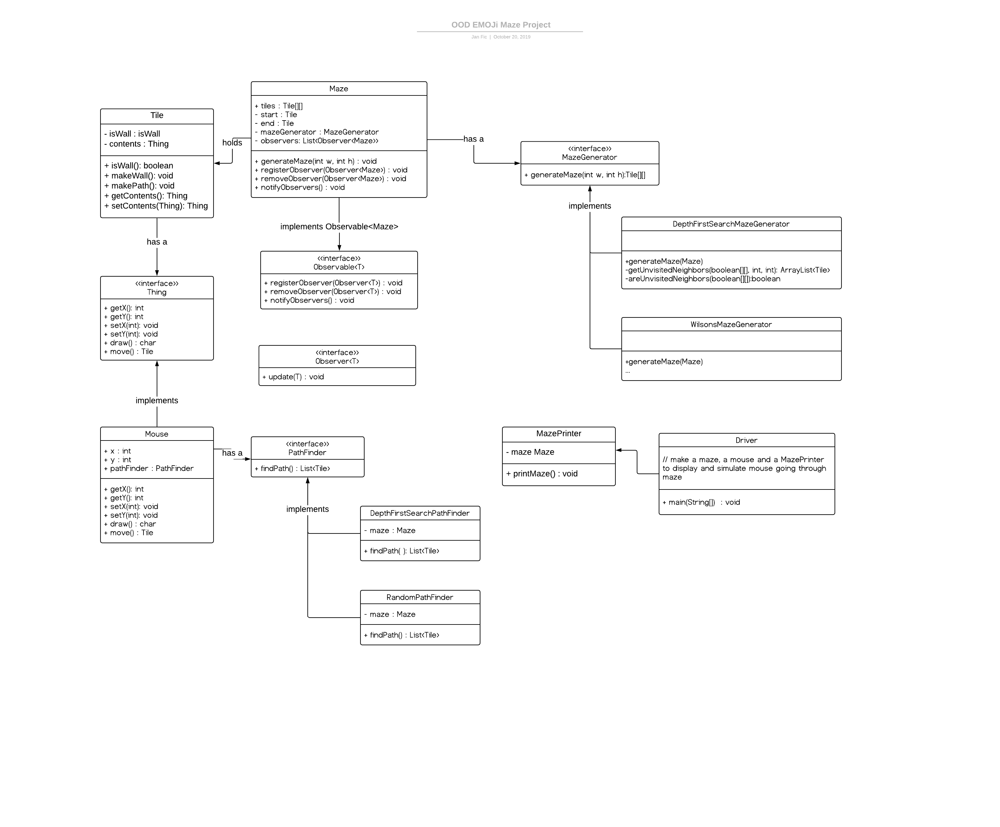

# Maze Project 🙀🌟👀🙃🐭

A Maze.

## Installation

Download and unzip all the files into one folder, then run Driver

## Reference

### Maze Contents

#### Tiles

Everything inside the Maze lives inside a `Tile`. 

Each `Tile` has a location {`int x`, `int y`} and optionally an inhabitant `Thing contents`.

`Tile` that are walls (`isWall`) cannot be inhabited.

#### Maze class

The `Maze` contains a reference `Tile[][] tiles` to each tile and their location.

It also knows which Tile is the maze entrance `Tile start` and goal `Tile end`.

`Maze` contains a `MazeGenerator generator` which is responsible for creating the layout of the maze. **You must run `generateMaze(int width, int height)` on a new Maze before attempting to traverse it.** All Tiles are null before generateMaze is called.

#### MazeGenerator

There are [many different ways] to create a maze! The `MazeGenerator` interface allows for the use of different algorithms to draw a maze, producing different types of passages.

`Tile[][] generateMaze(int w, int h)`: Given the size of a Maze, determine which Tiles are walls and which are paths, then return the newly populated tiles.

[many different ways]: http://weblog.jamisbuck.org/2011/2/7/maze-generation-algorithm-recap

